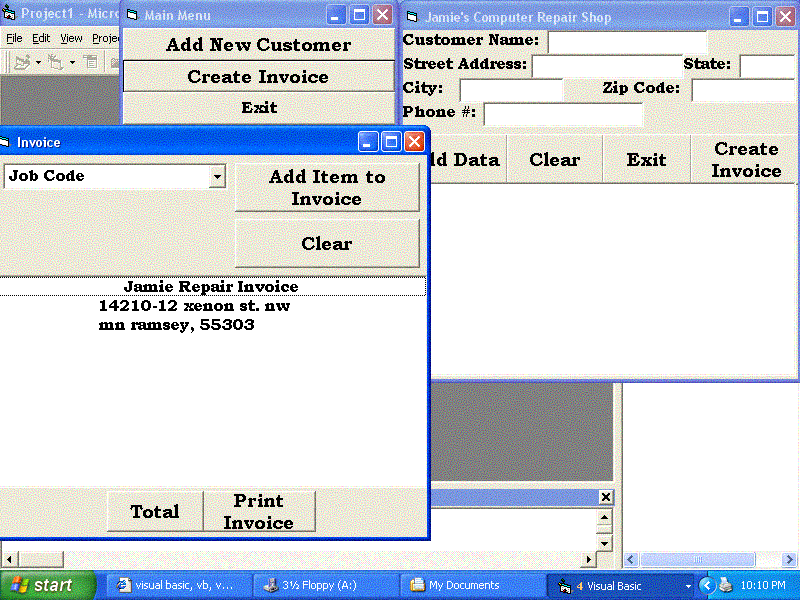



## Computer Repair Shop

### Description

This was my final project for VB6 class its not that intense but what can you expect from an introduction to VB6 class next quarter will be better so. But its a computer repair shop program it uses files and a few different forms I know theres modifications to make it better but I dont know how to do them but any help from any experienced programmers would be appreciated. Might need to change the dirrectory that it finds the file from had it running from my floppy disk.
 
### More Info
 

             |
---                |---
**Submitted On**   |2002-11-23 20:56:30
**By**             |[Jamie Cooper](https://github.com/Planet-Source-Code/PSCIndex/blob/master/ByAuthor/jamie-cooper.md)
**Level**          |Beginner
**User Rating**    |4.3 (13 globes from 3 users)
**Compatibility**  |VB 6\.0
**Category**       |[Files/ File Controls/ Input/ Output](https://github.com/Planet-Source-Code/PSCIndex/blob/master/ByCategory/files-file-controls-input-output__1-3.md)
**World**          |[Visual Basic](https://github.com/Planet-Source-Code/PSCIndex/blob/master/ByWorld/visual-basic.md)
**Archive File**   |[Computer\_R15025311232002\.zip](https://github.com/Planet-Source-Code/jamie-cooper-computer-repair-shop__1-41002/archive/master.zip)

